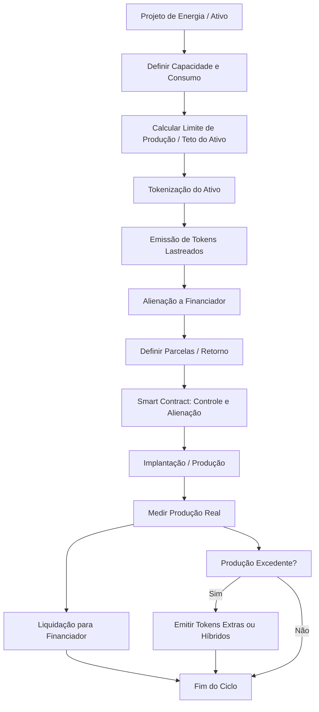

# Kindelia 🌟

## Um Cryptocomputer Minimalista, Seguro e Eficiente


**Kindelia é um cryptocomputer funcional projetado para execução massivamente paralela de DApps, com blockchain permanente e auditável, governança via DAO ativa, e tokenização de energia (kWh) e multi-ativos produtivos.**

Inspirado em Ethereum e Type-Theory, mas minimalista, seguro e funcional, com apenas ~10k LOC em Rust, executando códigos puramente funcionais e permitindo auditoria reversível de todos os blocos.

---

## 📋 Índice

- [Princípios Fundamentais](#princípios-fundamentais)
- [Arquitetura Completa](#arquitetura-completa)
- [Tokenização de Energia e Multi-Ativos](#tokenização-de-energia-e-multi-ativos)
- [Casos de Uso por Stakeholder](#casos-de-uso-por-stakeholder)
- [Potenciais de Tokenização e Mercados](#potenciais-de-tokenização-e-mercados)
- [Instalação e Deploy](#instalação-e-deploy)
- [Exemplos Práticos](#exemplos-práticos)
- [Documentação](#documentação)
- [Roadmap](#roadmap)
- [Contribuindo](#contribuindo)
- [Licença](#licença)

---

## 🎯 Princípios Fundamentais

| Princípio | Detalhes |
|-----------|----------|
| 🪙 **Sem moeda nativa** | Valor reside na computação e no processamento de dados |
| ⚡ **Eficiência Funcional** | HVM executa termos lambda paralelos com consumo mínimo |
| ⏱️ **Execução em Tempo Real** | Blocos de 1 segundo, heaps reversíveis, armazenamento gratuito (SSTORE) |
| 🌎 **Descentralização Máxima** | Governança, financiamento e evolução comunitária |
| 🧩 **Minimalismo Extremo** | Apenas o essencial: ~10k LOC vs 600k+ em Geth |
| 🔄 **Blockchain Paralela** | Execução e validação massivamente paralela |
| ⚡ **Tokenização de Ativos** | Energia (kWh) e outros ativos podem ser financiados e comercializados via blockchain |
| 🛡️ **Segurança Total** | Criptografia avançada, ZK-Proofs, resistência quântica e verificação formal |

---

## 🏗️ Arquitetura Completa

A Kindelia possui uma arquitetura em camadas que integra todas as funcionalidades necessárias para um ecossistema completo de tokenização e DApps:

```mermaid
flowchart TB
    subgraph CORE["🔷 CAMADA CORE"]
        HVM["⚡ HVM Runtime"]
        KIND["🌐 Protocolo Kindelia"]
        CONS["🔐 Consenso PoW"]
        EXEC["⚙️ Camada de Execução"]
    end
    
    subgraph INFRA["🏗️ INFRAESTRUTURA"]
        NODES["🖥️ Nós Funcionais"]
        API["🌐 API RPC Pública"]
        PROVIDERS["☁️ Provedores de Nós"]
        P2P["🔗 Rede P2P"]
    end
    
    subgraph DATA["💾 CAMADA DE DADOS"]
        STATE["📊 Gestão de Estado"]
        BLOCKS["🧊 Armazenamento de Blocos"]
        MERKLE["🌳 Árvores de Merkle"]
        IPFS["📦 Integração IPFS"]
    end
    
    subgraph DEVTOOLS["🛠️ FERRAMENTAS DE DESENVOLVIMENTO"]
        COMPILER["📝 Compilador KindeLang"]
        HVMJS["🌐 Runtime HVM.js"]
        IDE["💻 Plugin IDE"]
        DOCS["📚 Docs & SDK"]
        CLI["⌨️ Ferramentas CLI"]
        DEBUGGER["🐛 Depurador Funcional"]
    end
    
    subgraph WALLET["💼 CARTEIRA & IDENTIDADE"]
        UACCESS["🔑 Gerenciador de Acesso"]
        SIGNS["✍️ Motor de Assinaturas"]
        DID["🧬 Identidade Descentralizada"]
        STORAGE["🔐 Armazenamento Local"]
    end
    
    subgraph SECURITY["🛡️ SEGURANÇA"]
        AUDIT["🔒 Verificação Formal"]
        CRYPTO["🔐 Criptografia Avançada"]
        ZKSEC["🎭 Zero-Knowledge Proofs"]
        QRES["🌌 Resistência Quântica"]
    end
    
    subgraph ECONOMY["💎 ECONOMIA & TOKENOMIA"]
        GAS["⛽ Modelo de Gas"]
        STAKE["🏦 Staking Funcional"]
        MARKET["🛒 Marketplace DApps"]
        TREASURY["💰 Tesouraria DAO"]
        REWARDS["🎁 Sistema de Recompensas"]
    end
    
    subgraph GOV["🏛️ GOVERNANÇA"]
        DAO["🗳️ DAO"]
        PROPOSAL["📝 Sistema de Propostas"]
        VOTING["✅ Votação"]
    end
    
    subgraph APPS["🎯 APLICAÇÕES"]
        DAPPS["🚀 DApps Funcionais"]
        CONTRACTS["📜 Contratos Lambda"]
        TEMPLATES["📋 Modelos de Aplicação"]
        DEFI["💰 Protocolos DeFi"]
        NFT["🎨 Padrões NFT"]
    end
    
    subgraph ANALYTICS["📊 ANALÍTICA"]
        SCAN["🔍 KindScan"]
        MONITOR["📈 Monitor de Runtime"]
        STATS["📉 Estatísticas de Rede"]
        ALERTS["🔔 Alertas"]
    end
    
    subgraph TOKEN["⚡ TOKENIZAÇÃO DE ENERGIA & MULTI-ATIVOS"]
        ENERGY["☀️ Energia (kWh)"]
        ASSETS["🏭 Outros Ativos"]
        SMARTCONTRACT["📜 Contratos Inteligentes"]
        FINANCE["💰 Financiamento / Alienação"]
        MARKETPLACE["🛒 Mercado Secundário / Híbrido"]
    end
    
    %% Conexões principais
    HVM --> KIND & COMPILER
    KIND --> CONS & EXEC & NODES & P2P & STATE & DOCS & AUDIT & CRYPTO & GAS & DAO & SCAN & MONITOR
    NODES --> API & STATS
    API --> PROVIDERS
    STATE --> BLOCKS & MERKLE
    BLOCKS --> IPFS
    COMPILER --> HVMJS & IDE & CLI & CONTRACTS
    HVMJS --> DEBUGGER & DAPPS
    EXEC --> DAPPS
    DAPPS --> CONTRACTS & TEMPLATES & MARKET
    CONTRACTS --> DEFI & NFT
    CRYPTO --> ZKSEC
    ZKSEC --> QRES
    CONS --> STAKE
    STAKE --> TREASURY & REWARDS & VOTING
    DAO --> PROPOSAL
    PROPOSAL --> VOTING
    STATS --> ALERTS
    SCAN --> BLOCKS
    MONITOR --> NODES
    AUDIT --> CONTRACTS
    WALLET --> API & CRYPTO & DAPPS & DAO
    SIGNS --> UACCESS
    DID --> PROPOSAL
    UACCESS --> DAPPS & CLI
    TOKEN --> SMARTCONTRACT & FINANCE & MARKETPLACE
    ENERGY --> TOKEN
    ASSETS --> TOKEN
    SMARTCONTRACT --> CONTRACTS & DAPPS
    FINANCE --> TREASURY & DAO
    MARKETPLACE --> MARKET & DEFI
```



---

## ⚡ Tokenização de Energia e Multi-Ativos

A Kindelia suporta emissão de tokens lastreados em energia e ativos físicos, integrados diretamente na HVM paralelizada.

### 🔄 Fluxo de Tokenização



### 📊 Como Funciona na Prática

1. **Instalador** instala sistema solar de 10kW
2. **Sistema** gera estimativa de 1.200 kWh/mês
3. **Tokens** são emitidos: 1.200 SOLAR por mês
4. **Investidor** compra tokens antecipadamente: R$ 0,50/kWh = R$ 600/mês
5. **Smart Contract** monitora produção real via IoT
6. **Pagamento** automático ao investidor conforme energia gerada
7. **Excedente** (se produzir mais) gera tokens extras para o instalador

---

## 👥 Casos de Uso por Stakeholder

### ⚡ Para Instaladores de Energia Solar

**Como usar:**

1. **Tokenização de Instalações**: Cada sistema solar instalado pode ser tokenizado baseado em sua capacidade de geração
2. **Financiamento Antecipado**: Venda tokens futuros para financiar novas instalações
3. **Automação de Pagamentos**: Contratos inteligentes automatizam medição e pagamento
4. **Gestão de Portfólio**: Monitore todas suas instalações em tempo real via blockchain

**Exemplo prático:**
```
Sistema: 10kW solar
Produção mensal: 1.200 kWh
Tokens emitidos: 1.200 SOLAR
Preço: R$ 0,50/kWh = R$ 600/mês em valor
Investimento obtido antecipadamente: R$ 7.200 (12 meses)
```

**Benefícios:**
- ✅ Capital de giro imediato
- ✅ Redução de inadimplência
- ✅ Expansão acelerada de operações
- ✅ Transparência com clientes

---

### 🏢 Para Fornecedores de Equipamentos

**Casos de uso:**

1. **Garantia Tokenizada**: Cada equipamento vendido tem garantia representada por tokens
2. **Rastreabilidade Total**: Blockchain registra toda a cadeia de fornecimento
3. **Financiamento de Estoque**: Tokenize estoque para obter liquidez
4. **Marketplace B2B**: Crie marketplace descentralizado de equipamentos
5. **Certificações**: Registre certificações e homologações na blockchain

**Fluxo de Garantia Tokenizada:**
```
Painel Solar X → Token de Garantia (5 anos)
↓
Se defeito → Queima token → Emite reposição automaticamente
↓
Sem defeito → Token expira → Histórico de qualidade registrado
```

---

### 💰 Para Clientes (Consumidores)

**Benefícios diretos:**

1. **Comprar Energia Futura**: Fixe preços e proteja-se de aumentos tarifários
2. **Investimento Fracionado**: Invista em painéis solares de terceiros
3. **Créditos de Energia**: Acumule e revenda créditos
4. **Transparência Total**: Veja produção e consumo em tempo real
5. **Cashback Verde**: Receba recompensas por consumo sustentável

**Exemplo de economia:**
```
Tarifa atual: R$ 0,85/kWh
Token pré-comprado: R$ 0,50/kWh
Consumo mensal: 500 kWh
Economia mensal: R$ 175
Economia anual: R$ 2.100
```

---

### 🏦 Para Bancos e Instituições Financeiras

**Oportunidades:**

1. **Financiamento Garantido**: Empreste contra tokens lastreados em ativos reais
2. **Novos Produtos Financeiros:**
   - Fundos de energia renovável tokenizados
   - CDIs verdes baseados em tokens de energia
   - Derivativos de energia limpa
   - ETFs de energia solar descentralizados

3. **Redução de Risco**: Smart contracts garantem pagamentos automáticos
4. **Análise em Tempo Real**: Blockchain auditável permite análise de risco instantânea
5. **Compliance Automático**: Verificação formal e auditoria permanente

**Produto exemplo - "CDI Verde":**
```
Investimento: R$ 100.000
Lastro: Tokens de 50 instalações solares
Retorno: 110% do CDI
Liquidez: D+30 via mercado secundário
ESG Score: Automático via blockchain
```

---

### 💎 Para Investidores

**Como investir:**

1. **Comprar Tokens de Energia**: Invista em projetos solares específicos
2. **Mercado Secundário**: Negocie tokens em marketplace híbrido
3. **Staking e Rewards**: Participe do sistema de recompensas
4. **Governança via DAO**: Participe de decisões estratégicas

**Exemplo de retorno:**
```
Investimento: R$ 10.000 em tokens solares
Geração: 200 kWh/mês
Valor mercado: R$ 0,65/kWh
Retorno mensal: R$ 130 (1,3% a.m.)
Retorno anual: 15,6% a.a.
Payback: ~6,5 anos
+ Valorização do token
+ Benefícios de governança
```

**Portfólio Diversificado:**
- 40% tokens solares residenciais
- 30% tokens solares comerciais
- 20% tokens eólicos
- 10% outros ativos produtivos

---

### 🔧 Para DevOps e Desenvolvedores

**Ferramentas disponíveis:**

- CLI completo para automação
- IDE plugins (VSCode, IntelliJ)
- Compilador KindeLang
- Depurador funcional
- SDK em múltiplas linguagens
- API RPC pública
- Docker & Kubernetes ready

**Deploy simplificado:**

```bash
# Build com Docker
docker build -t scoobiii/kindelia .

# Executar nó
docker run -d --name kindelia-node -p 8080:8080 scoobiii/kindelia

# Ou com docker-compose
docker-compose up -d
```

**Criar contratos de energia:**

```bash
# Token de energia
kdl run kdl/energia/token_energia.kdl --node http://localhost:8080

# Alienação (venda antecipada)
kdl run kdl/energia/alienacao_energia.kdl --node http://localhost:8080

# Produção excedente
kdl run kdl/energia/producao_excedente.kdl --node http://localhost:8080

# Liquidação
kdl run kdl/energia/liquidacao_energia.kdl --node http://localhost:8080
```

**Testes automatizados:**

```bash
cargo test --test integracao/energia_test.rs
cargo test --test integracao/multiativos_test.rs

# Benchmarks
cargo bench --bench energia_bench
```

**CI/CD Integration:**
```yaml
# .github/workflows/kindelia-ci.yml
name: Kindelia CI
on: [push, pull_request]
jobs:
  test:
    runs-on: ubuntu-latest
    steps:
      - uses: actions/checkout@v2
      - name: Run tests
        run: cargo test --all-features
      - name: Deploy contracts
        run: ./scripts/deploy.sh
```

---

## 🌍 Potenciais de Tokenização e Mercados

A Kindelia suporta tokenização de diversos tipos de ativos produtivos além de energia solar. Aqui está um catálogo completo de possibilidades:

### 1. ☀️ Energia Renovável

#### **Solar Fotovoltaica**
- **Residencial**: Sistemas de 3-10kW
- **Comercial**: Sistemas de 50-500kW
- **Usinas**: Sistemas acima de 1MW
- **Mercado potencial**: R$ 15 bilhões/ano no Brasil

#### **Energia Eólica**
- **Mini-eólica**: Turbinas de 5-100kW
- **Parques eólicos**: Consórcios tokenizados
- **Offshore**: Energia eólica marítima
- **Tokens**: kWh gerado + créditos de carbono

#### **Hidrelétrica (PCH/CGH)**
- Pequenas Centrais Hidrelétricas
- Centrais de Geração Hidrelétrica
- Tokenização por MW instalado

#### **Biomassa e Biogás**
- Usinas de biogás de resíduos
- Biodigestores rurais
- Co-geração industrial
- Tokens: Energia + Créditos ambientais

---

### 2. 🏭 Ativos Industriais e Produtivos

#### **Máquinas e Equipamentos**
```
Torno CNC → Tokenizar horas de uso
└── 1 token = 1 hora de operação
    ├── Venda antecipada: Financie compra
    ├── Compartilhamento: Empresas dividem custo
    └── Manutenção: Reserva automática
```

**Exemplos:**
- Impressoras 3D industriais
- Equipamentos de mineração
- Máquinas agrícolas (colheitadeiras, tratores)
- Equipamentos de construção
- Veículos comerciais (caminhões, ônibus)

**Mercado potencial**: Economia compartilhada industrial

---

#### **Capacidade de Produção**
```
Fábrica de Componentes
├── Capacidade: 10.000 unidades/mês
├── Tokenização: 10.000 tokens
├── Venda: Empresas compram produção futura
└── Benefício: Capital de giro garantido
```

---

### 3. 🌾 Agronegócio e Agricultura

#### **Safras Futuras**
- **Soja, milho, café, cana**: Tokenize colheita futura
- **Pecuária**: Tokens de gado (boi, leite)
- **Aquicultura**: Produção de peixes, camarões
- **Fruticultura**: Produção de frutas

**Exemplo - Token de Safra:**
```
Fazenda: 100 hectares de soja
Produção esperada: 300 toneladas
Tokens emitidos: 300 SOJA
Preço atual: R$ 150/saca (60kg)
Valor total: R$ 750.000
Investidores: Compram tokens com 20% desconto
Agricultor: Recebe R$ 600.000 antecipado
Risco: Compartilhado via smart contract
```

---

#### **Irrigação e Infraestrutura**
- Sistemas de irrigação compartilhados
- Armazenagem (silos, armazéns)
- Equipamentos agrícolas

---

### 4. 🏘️ Imobiliário e Infraestrutura

#### **Fracionamento Imobiliário**
- **Imóveis comerciais**: Escritórios, lojas
- **Imóveis residenciais**: Apartamentos, casas
- **Imóveis rurais**: Terras produtivas
- **REITs descentralizados**: Fundos imobiliários tokenizados

**Exemplo:**
```
Prédio comercial: R$ 10.000.000
Tokens emitidos: 10.000 BUILDING
Preço por token: R$ 1.000
Aluguel mensal: R$ 100.000
Distribuição: Automática via smart contract
Rendimento: 1% a.m. por token
```

---

#### **Infraestrutura Urbana**
- **Estacionamentos**: Tokenize vagas
- **Torres de telecom**: Compartilhe receita
- **Datacenter**: Capacidade de processamento
- **Redes de fibra ótica**: Infraestrutura de internet

---

### 5. 💧 Recursos Naturais

#### **Água**
- **Poços artesianos**: Tokenize m³
- **Estações de tratamento**: Capacidade de tratamento
- **Irrigação**: Direitos de uso de água
- **Dessalinização**: Água potável de usinas

#### **Créditos Ambientais**
- **Créditos de carbono**: CO₂ compensado
- **Reflorestamento**: Árvores plantadas
- **Preservação**: Áreas conservadas
- **Biodiversidade**: Espécies protegidas

**Token de Carbono:**
```
Projeto: Reflorestamento 1.000 hectares
Captura: 50.000 toneladas CO₂/ano
Tokens: 50.000 CARBON
Mercado: Empresas compram para compensação
Receita: R$ 50-150 por tonelada
Verificação: Satélite + IoT + Blockchain
```

---

### 6. 🎓 Educação e Capital Humano

#### **Educação Tokenizada**
- **Cursos e treinamentos**: Tokens de aprendizado
- **Certificações**: Diplomas na blockchain
- **Bolsas de estudo**: Crowdfunding educacional
- **Income Share Agreements (ISA)**: Invista em pessoas

**ISA Tokenizado:**
```
Estudante: Curso de programação R$ 20.000
Investidores: Compram tokens ISA
Contrato: 10% da renda futura por 3 anos
Teto: R$ 40.000 (200% do investimento)
Smart contract: Pagamento automático via folha
ROI: 15-25% a.a. para investidores
```

---

### 7. 🎵 Propriedade Intelectual e Royalties

#### **Música e Entretenimento**
- **Direitos autorais**: Músicas, álbuns
- **Streaming**: Receita futura de plays
- **Shows**: Bilheteria tokenizada
- **NFTs musicais**: Edições limitadas + royalties

#### **Livros e Publicações**
- **Royalties de livros**: Receita de vendas
- **Artigos científicos**: Acesso tokenizado
- **Conteúdo digital**: Cursos, e-books

#### **Patentes e Tecnologia**
- **Patentes**: Licenciamento tokenizado
- **Software**: Receita recorrente (SaaS)
- **Marcas**: Franchising descentralizado

---

### 8. 🏥 Saúde e Biotecnologia

#### **Equipamentos Médicos**
- **Ressonância, tomografia**: Horas de uso
- **Laboratórios**: Capacidade de análise
- **Clínicas**: Consultas tokenizadas

#### **Pesquisa e Desenvolvimento**
- **Ensaios clínicos**: Financiamento coletivo
- **Desenvolvimento de medicamentos**: Retorno futuro
- **Biotecnologia**: Patentes compartilhadas

---

### 9. 🚗 Mobilidade e Transporte

#### **Veículos Compartilhados**
- **Carros**: Propriedade fracionada
- **Bicicletas e patinetes**: Frotas tokenizadas
- **Aviões**: Jatos compartilhados
- **Barcos**: Embarcações de lazer

#### **Logística**
- **Frota de caminhões**: Capacidade de carga
- **Armazéns**: Espaço de estocagem
- **Rotas**: Direitos de transporte

---

### 10. 🎮 Economia Digital

#### **Gaming**
- **Servidores**: Capacidade de hospedagem
- **Itens de jogo**: NFTs com utilidade
- **E-sports**: Premiações tokenizadas
- **Streaming**: Receita de visualizações

#### **Metaverso**
- **Terrenos virtuais**: Propriedade digital
- **Eventos virtuais**: Ingressos e espaços
- **Avatares e assets**: NFTs funcionais

---

### 11. 🔬 Ciência e Pesquisa

#### **Laboratórios Compartilhados**
- **Equipamentos científicos**: Tempo de uso
- **Supercomputadores**: Poder de processamento
- **Telescópios**: Observação astronômica

#### **Dados Científicos**
- **Datasets**: Acesso a dados
- **Algoritmos**: Licenciamento de IA
- **Descobertas**: Royalties de pesquisas

---

### 12. ♻️ Economia Circular

#### **Reciclagem**
- **Materiais reciclados**: Toneladas processadas
- **Resíduos**: Coleta e tratamento
- **Compostagem**: Produção de adubo

#### **Reuso**
- **Produtos recondicionados**: Eletrônicos, móveis
- **Compartilhamento**: Ferramentas, livros
- **Aluguel**: Bens duráveis

---

## 📊 Comparativo de Mercados Potenciais

| Setor | Mercado Brasil (Anual) | Mercado Global | Maturidade | Potencial Kindelia |
|-------|----------------------|----------------|------------|-------------------|
| Energia Solar | R$ 15 bi | $200 bi | ⭐⭐⭐⭐⭐ | MUITO ALTO |
| Agronegócio | R$ 2 tri | $3 tri | ⭐⭐⭐⭐ | ALTO |
| Imobiliário | R$ 500 bi | $10 tri | ⭐⭐⭐ | MÉDIO-ALTO |
| Créditos Carbono | R$ 5 bi | $850 bi | ⭐⭐⭐⭐ | ALTO |
| Equipamentos | R$ 100 bi | $2 tri | ⭐⭐⭐ | MÉDIO |
| Educação | R$ 200 bi | $6 tri | ⭐⭐ | MÉDIO |
| Royalties | R$ 50 bi | $500 bi | ⭐⭐ | MÉDIO |
| Mobilidade | R$ 300 bi | $8 tri | ⭐⭐⭐ | MÉDIO-ALTO |

---

## 🚀 Instalação e Deploy

### Pré-requisitos

- Docker 20.10+
- Rust 1.70+
- 4GB RAM mínimo
- 20GB disco

### Quick Start

```bash
# Clone o repositório
git clone https://github.com/scoobiii/Kindelia.git
cd Kindelia

# Build com Docker
docker build -t scoobiii/kindelia .

# Executar nó completo
docker run -d \
  --name kindelia-node \
  -p 8080:8080 \
  -v kindelia-data:/data \
  scoobiii/kindelia

# Verificar status
docker logs kindelia-node

# Ou usar docker-compose para stack completa
docker-compose up -d
```

### Deploy em Produção

```bash
# Kubernetes
kubectl apply -f k8s/kindelia-deployment.yml

# Ou terraform
cd terraform/
terraform init
terraform apply
```

---

## 💻 Exemplos Práticos

### Exemplo 1: Token de Energia Solar

```rust
// token_energia.kdl

// Definir usina solar
usina_solar {
  capacidade: 10000,  // 10kW
  producao_mensal: 1200,  // kWh
  localizacao: "São Paulo, SP",
  instalador: "SolarTech LTDA"
}

// Emitir tokens
emitir_tokens {
  tipo: "SOLAR",
  quantidade: 1200,
  lastro: usina_solar,
  preco_inicial: 0.50  // R$ por kWh
}

// Contrato de alienação
contrato_alienacao {
  vendedor: instalador,
  comprador: investidor,
  tokens: 600,  // 50% da produção
  prazo: 12,  // meses
  forma_pagamento: "mensal_automatico"
}

// Medição e liquidação automática
monitorar_producao {
  iot_device: "inversor_solar_001",
  frequencia: "tempo_real",
  callback: liquidar_tokens
}
```

### Exemplo 2: Tokenização de Safra Agrícola

```rust
// token_safra.kdl

// Definir safra
safra_soja {
  area: 100,  // hectares
  producao_esperada: 300,  // toneladas
  safra: "2025/2026",
  fazenda: "Fazenda Boa Vista",
  agricultor: "João Silva"
}

// Emitir tokens com desconto
emitir_tokens {
  tipo: "SOJA2025",
  quantidade: 300,
  lastro: safra_soja,
  preco_mercado: 2500,  // R$ por tonelada
  desconto_antecipacao: 20%,  // R$ 2000 por tonelada
  valor_total: 600000  // R$
}

// Seguro integrado
seguro_safra {
  cobertura: ["seca", "geada", "pragas"],
  premio: 5%,
  parametrico: true,
  trigger_automatico: "dados_meteorologicos"
}

// Distribuição automática na colheita
distribuir_colheita {
  medicao: "balanca_certificada",
  split: {
    investidores: 50%,
    agricultor: 50%
  },
  marketplace_excedente: true
}
```

### Exemplo 3: Imóvel Fracionado

```rust
// token_imovel.kdl

// Definir imóvel
imovel_comercial {
  tipo: "predio_comercial",
  endereco: "Av. Paulista, 1000",
  area: 2000,  // m²
  valor_avaliacao: 10000000,  // R$ 10 milhões
  aluguel_mensal: 100000  // R$ 100k/mês
}

// Tokenização fracionada
emitir_tokens {
  tipo: "BUILDING_PAULISTA",
  quantidade: 10000,
  valor_por_token: 1000,  // R$ 1.000
  lastro: imovel_comercial,
  liquidez: "mercado_secundario"
}

// Distribuição automática de aluguel
distribuir_aluguel {
  frequencia: "mensal",
  receita: 100000,
  custos: {
    manutencao: 10000,
    impostos: 15000,
    gestao: 5000
  },
  liquido: 70000,
  por_token: 7  // R$ 7 por token/mês (0,7% a.m.)
}

// Votação de melhorias
proposta_reforma {
  descricao: "Modernizar elevadores",
  custo: 200000,
  votacao_minima: 51%,
  prazo_votacao: 30  // dias
}
```

### Exemplo 4: Crédito de Carbono

```rust
// token_carbono.kdl

// Projeto de reflorestamento
projeto_reflorestamento {
  area: 1000,  // hectares
  especies: ["ipê", "jatobá", "cedro"],
  plantio: 500000,  // árvores
  captura_co2_anual: 50000,  // toneladas
  localizacao: "Amazônia Legal",
  certificacao: "VCS_Verified"
}

// Emitir créditos de carbono
emitir_tokens {
  tipo: "CARBON_AMAZON",
  quantidade: 50000,  // 1 token = 1 ton CO₂
  lastro: projeto_reflorestamento,
  preco_inicial: 100,  // R$ por tonelada
  validade: 10  // anos
}

// Monitoramento por satélite
monitoramento {
  fonte: ["sentinel_2", "landsat_8"],
  frequencia: "mensal",
  verificacao: {
    crescimento_florestal: true,
    desmatamento: false,
    incendios: false
  },
  audit_automatico: true
}

// Marketplace para empresas
compensacao_carbono {
  comprador: "Empresa XYZ LTDA",
  emissoes_anuais: 1000,  // tons CO₂
  tokens_necessarios: 1000,
  certificado_blockchain: true,
  relatorio_esg: "automatico"
}
```

### Exemplo 5: Equipamento Industrial Compartilhado

```rust
// token_equipamento.kdl

// Definir máquina CNC
maquina_cnc {
  modelo: "Haas VF-4SS",
  valor: 500000,  // R$
  capacidade: "200 horas/mês",
  localizacao: "Hub Industrial SP",
  manutencao_inclusa: true
}

// Tokenizar horas de uso
emitir_tokens {
  tipo: "CNC_HOURS",
  quantidade: 2400,  // 200h/mês x 12 meses
  preco_por_hora: 250,  // R$
  lastro: maquina_cnc,
  transferivel: true
}

// Sistema de agendamento
agendar_uso {
  empresa: "Metalúrgica ABC",
  tokens_gastos: 20,  // 20 horas
  data: "2025-11-15",
  horario: "08:00-18:00",
  auto_desconto: true
}

// Manutenção preventiva automática
manutencao {
  a_cada_horas: 500,
  custo: 5000,
  reserva_automatica: {
    por_uso: 2%,
    fundo_manutencao: "smart_contract"
  }
}
```

---

## 🎯 Diferenciais Técnicos

### 🚀 Performance

- **Paralelismo Real**: HVM executa termos lambda paralelos
- **10k LOC vs 600k+**: 98% menos código que Ethereum/Geth
- **Blocos de 1 segundo**: 60x mais rápido que Bitcoin
- **SSTORE Gratuito**: Armazenamento sem custos de gas
- **Consumo Mínimo**: Eficiência energética superior

### 🔒 Segurança

- **Verificação Formal**: Provas matemáticas de correção
- **Zero-Knowledge Proofs**: Privacidade preservada
- **Resistência Quântica**: Criptografia pós-quântica
- **Auditoria Reversível**: Todos os blocos auditáveis
- **Sem Vulnerabilidades de Reentrância**: Design funcional puro

### 🌐 Descentralização

- **Sem Moeda Especulativa**: Foco em valor real
- **DAO Ativa**: Governança comunitária
- **Consenso Descentralizado**: PoW funcional
- **P2P Robusto**: Rede peer-to-peer eficiente
- **IPFS Integrado**: Armazenamento distribuído

### 💎 Economia

- **Gas Eficiente**: Modelo econômico justo
- **Staking Funcional**: Recompensas por participação
- **Marketplace Nativo**: DApps e tokens
- **Tesouraria DAO**: Fundos comunitários
- **Recompensas Automáticas**: Smart contracts

---

## 📁 Estrutura do Projeto

```
Kindelia/
├── README.md                    # Este arquivo
├── WHITEPAPER.md               # Paper técnico completo
├── WHITEBOOK.md                # Guia de uso
├── Dockerfile                  # Container Docker
├── docker-compose.yml          # Orquestração
├── Cargo.toml                  # Dependências Rust
├── Cargo.lock
├── rust-toolchain
│
├── src/                        # Código fonte
│   ├── api/                    # API RPC
│   ├── cli.rs                  # Interface CLI
│   ├── common.rs               # Utilitários
│   ├── crypto.rs               # Criptografia
│   ├── dao/                    # Sistema DAO
│   ├── devtools/               # Ferramentas dev
│   ├── hvm.rs                  # Runtime HVM
│   ├── node.rs                 # Nó da rede
│   └── wallet/                 # Carteira
│
├── docs/                       # Documentação
│   ├── WHITEPAPER.md
│   ├── WHITEBOOK.md
│   ├── ARCHITECTURE.md
│   ├── DAO_STRUCTURE.md
│   ├── TOKENIZATION.md
│   ├── DEPLOY_AND_TEST.md
│   ├── API_REFERENCE.md
│   └── TUTORIALS/
│
├── kdl/                        # Contratos KindeLang
│   ├── energia/
│   │   ├── token_energia.kdl
│   │   ├── alienacao_energia.kdl
│   │   ├── producao_excedente.kdl
│   │   └── liquidacao_energia.kdl
│   ├── multiativos/
│   │   ├── token_multiativo.kdl
│   │   ├── token_safra.kdl
│   │   ├── token_imovel.kdl
│   │   └── token_carbono.kdl
│   ├── defi/
│   │   ├── lending.kdl
│   │   ├── staking.kdl
│   │   └── swap.kdl
│   └── nft/
│       ├── nft_standard.kdl
│       └── nft_royalties.kdl
│
├── scripts/                    # Scripts de automação
│   ├── test.sh
│   ├── bench.sh
│   ├── deploy.sh
│   └── monitoring.sh
│
├── tests/                      # Testes
│   ├── integracao/
│   │   ├── energia_test.rs
│   │   ├── multiativos_test.rs
│   │   └── dao_test.rs
│   └── unit/
│
├── benches/                    # Benchmarks
│   ├── hvm_bench.rs
│   └── energia_bench.rs
│
├── examples/                   # Exemplos práticos
│   ├── hello_world.kdl
│   ├── simple_token.kdl
│   └── complete_dapp/
│
├── k8s/                        # Kubernetes
│   ├── kindelia-deployment.yml
│   ├── kindelia-service.yml
│   └── monitoring/
│
├── terraform/                  # Infrastructure as Code
│   ├── main.tf
│   ├── variables.tf
│   └── outputs.tf
│
└── assets/                     # Assets
    ├── logo.png
    └── diagrams/
```

---

## 📚 Documentação Completa

### Documentos Principais

- **[WHITEPAPER.md](docs/WHITEPAPER.md)**: Fundamentos técnicos e arquitetura
- **[WHITEBOOK.md](docs/WHITEBOOK.md)**: Guia prático de uso
- **[ARCHITECTURE.md](docs/ARCHITECTURE.md)**: Arquitetura detalhada
- **[DAO_STRUCTURE.md](docs/DAO_STRUCTURE.md)**: Governança e DAO
- **[TOKENIZATION.md](docs/TOKENIZATION.md)**: Guia de tokenização
- **[DEPLOY_AND_TEST.md](docs/DEPLOY_AND_TEST.md)**: Deploy, testes e monitoramento
- **[API_REFERENCE.md](docs/API_REFERENCE.md)**: Referência completa da API

### Tutoriais

- [Como criar seu primeiro token de energia](docs/TUTORIALS/primeiro_token.md)
- [Tokenização de safra agrícola passo a passo](docs/TUTORIALS/safra_agricola.md)
- [Deploy de contrato em produção](docs/TUTORIALS/deploy_producao.md)
- [Integração com IoT para medição](docs/TUTORIALS/integracao_iot.md)
- [Criando uma DAO para seu projeto](docs/TUTORIALS/criar_dao.md)

---

## 🧪 Testes e Qualidade

### Executar Testes

```bash
# Todos os testes
cargo test --all-features

# Testes de integração
cargo test --test integracao/*

# Testes de energia
cargo test --test integracao/energia_test.rs

# Testes de multi-ativos
cargo test --test integracao/multiativos_test.rs

# Testes com saída detalhada
cargo test -- --nocapture --test-threads=1

# Benchmarks
cargo bench --bench energia_bench
```

### Cobertura de Testes

```bash
# Instalar tarpaulin
cargo install cargo-tarpaulin

# Gerar relatório de cobertura
cargo tarpaulin --out Html --output-dir coverage/

# Ver cobertura
open coverage/index.html
```

### Qualidade de Código

```bash
# Linting
cargo clippy --all-features -- -D warnings

# Formatação
cargo fmt --all -- --check

# Audit de segurança
cargo audit

# Verificação completa
./scripts/quality_check.sh
```

---

## 📊 Monitoramento e Observabilidade

### Métricas Disponíveis

- **Performance**: TPS, latência, throughput
- **Rede**: Nós ativos, conexões P2P, propagação de blocos
- **Contratos**: Execuções, gas consumido, erros
- **Tokens**: Volume, transações, holders
- **DAO**: Propostas, votos, participação

### Stack de Monitoramento

```yaml
# docker-compose-monitoring.yml
version: '3.8'
services:
  prometheus:
    image: prom/prometheus
    ports:
      - "9090:9090"
    volumes:
      - ./prometheus.yml:/etc/prometheus/prometheus.yml
  
  grafana:
    image: grafana/grafana
    ports:
      - "3000:3000"
    environment:
      - GF_SECURITY_ADMIN_PASSWORD=kindelia
  
  kindelia-exporter:
    image: scoobiii/kindelia-exporter
    ports:
      - "9100:9100"
```

### Dashboards Pré-configurados

- **Network Overview**: Visão geral da rede
- **Token Analytics**: Análise de tokens
- **Energy Metrics**: Métricas de energia
- **DAO Governance**: Governança e votações
- **Performance**: Performance e latência

---

## 🗺️ Roadmap

### ✅ Q4 2024 - Fase Alpha

- [x] Core HVM funcional
- [x] Blockchain básica
- [x] Tokenização de energia
- [x] Smart contracts KindeLang
- [x] CLI e ferramentas básicas
- [x] Docker e deployment inicial

### 🚧 Q1 2025 - Fase Beta

- [x] DAO e governança
- [x] Marketplace de tokens
- [x] Integração IPFS
- [x] Multi-ativos produtivos
- [ ] Mobile wallet (iOS/Android)
- [ ] Web wallet PWA
- [ ] KindScan explorer

### 🔮 Q2 2025 - Fase 1.0

- [ ] Mainnet launch
- [ ] Integração com IoT devices
- [ ] API pública estável
- [ ] SDK em múltiplas linguagens (Python, JS, Go)
- [ ] Ponte para outras blockchains
- [ ] Auditoria de segurança completa

### 🌟 Q3-Q4 2025 - Expansão

- [ ] Zero-Knowledge proofs avançados
- [ ] Sharding e escalabilidade
- [ ] Integração com exchanges
- [ ] Parcerias com fornecedores de energia
- [ ] Marketplace B2B
- [ ] Inteligência artificial para análise

### 🚀 2026 - Ecossistema

- [ ] DeFi protocols nativos
- [ ] NFT marketplace
- [ ] Metaverso integration
- [ ] Cross-chain bridges
- [ ] Global expansion
- [ ] Enterprise solutions

---

## 🤝 Contribuindo

Adoramos contribuições! Veja como você pode ajudar:

### Como Contribuir

1. **Fork** o repositório
2. **Clone** seu fork: `git clone https://github.com/seu-usuario/Kindelia.git`
3. **Crie uma branch**: `git checkout -b feature/minha-feature`
4. **Faça suas alterações** e commit: `git commit -m 'Add: minha feature'`
5. **Push** para o GitHub: `git push origin feature/minha-feature`
6. **Abra um Pull Request**

### Áreas para Contribuição

- 🐛 **Bug fixes**: Corrija bugs e melhore estabilidade
- ✨ **Features**: Implemente novas funcionalidades
- 📝 **Documentação**: Melhore docs e tutoriais
- 🧪 **Testes**: Aumente cobertura de testes
- 🎨 **UI/UX**: Melhore interfaces
- 🌍 **Tradução**: Traduza documentação
- 💡 **Ideias**: Sugira melhorias

### Diretrizes

- Siga o estilo de código Rust padrão
- Escreva testes para novas features
- Documente código complexo
- Mantenha commits atômicos e descritivos
- Seja respeitoso e construtivo

### Código de Conduta

Este projeto adota o [Contributor Covenant](CODE_OF_CONDUCT.md). Ao participar, você concorda em seguir seus termos.

---

## 🌟 Casos de Sucesso e Pilotos

### Projeto Piloto 1: Solar Comunitária SP

**Status**: Em andamento
- **Instalações**: 50 sistemas residenciais
- **Capacidade total**: 500kW
- **Investidores**: 200+ pessoas
- **Tokens emitidos**: 60.000 SOLAR
- **ROI médio**: 14% a.a.

### Projeto Piloto 2: Safra Tokenizada MT

**Status**: Colheita 2024/2025
- **Área**: 500 hectares de soja
- **Produção**: 1.500 toneladas
- **Capital levantado**: R$ 3.000.000
- **Investidores**: 50 empresas
- **Desconto**: 18% sobre preço futuro

### Projeto Piloto 3: Prédio Fracionado RJ

**Status**: Operacional
- **Imóvel**: Prédio comercial Botafogo
- **Valor**: R$ 5.000.000
- **Tokens**: 5.000 BUILDING
- **Holders**: 150 investidores
- **Rendimento**: 0,9% a.m.

---

## 🔗 Links Úteis

### Comunidade

- **Discord**: [discord.gg/kindelia](https://discord.gg/kindelia)
- **Telegram**: [t.me/kindelia](https://t.me/kindelia)
- **Twitter**: [@KindeliaNet](https://twitter.com/KindeliaNet)
- **LinkedIn**: [Kindelia Network](https://linkedin.com/company/kindelia)
- **YouTube**: [Kindelia Tutorials](https://youtube.com/@kindelia)

### Desenvolvimento

- **GitHub**: [github.com/scoobiii/Kindelia](https://github.com/scoobiii/Kindelia)
- **Documentation**: [docs.kindelia.org](https://docs.kindelia.org)
- **API Reference**: [api.kindelia.org](https://api.kindelia.org)
- **Explorer**: [explorer.kindelia.org](https://explorer.kindelia.org)

### Recursos

- **Medium Blog**: [medium.com/@kindelia](https://medium.com/@kindelia)
- **GitBook**: [kindelia.gitbook.io](https://kindelia.gitbook.io)
- **Stack Overflow**: Tag `kindelia`
- **Reddit**: [r/kindelia](https://reddit.com/r/kindelia)

---

## 💼 Parcerias e Negócios

Interessado em integrar Kindelia ao seu negócio? Temos programas especiais:

### Para Empresas

- **Enterprise License**: Suporte dedicado e SLA
- **White Label**: Customize para sua marca
- **Integração Customizada**: APIs sob medida
- **Consultoria**: Especialistas em tokenização

### Para Instituições Financeiras

- **Banking API**: Integração com core bancário
- **Compliance**: KYC/AML integrado
- **Custódia**: Solução de custódia segura
- **Derivativos**: Produtos financeiros tokenizados

### Para Desenvolvedores

- **Grants Program**: Financiamento para DApps
- **Accelerator**: 3 meses de aceleração
- **Hackathons**: Eventos e premiações
- **Developer Relations**: Suporte técnico

**Contato**: partnerships@kindelia.org

---

## ⚖️ Compliance e Regulamentação

Kindelia está comprometido com conformidade regulatória:

- ✅ **LGPD/GDPR**: Privacidade de dados
- ✅ **KYC/AML**: Identificação de usuários
- ✅ **Securities**: Análise de tokens como valores mobiliários
- ✅ **Tributação**: Ferramentas para declaração de IR
- ✅ **Auditoria**: Logs permanentes e auditáveis

**Importante**: Consulte sempre um advogado especializado em criptoativos e blockchain antes de tokenizar ativos.

---

## 📄 Licença

Este projeto está licenciado sob a **MIT License** - veja o arquivo [LICENSE](LICENSE) para detalhes.

```
MIT License

Copyright (c) 2024 Kindelia Network

Permission is hereby granted, free of charge, to any person obtaining a copy
of this software and associated documentation files (the "Software"), to deal
in the Software without restriction, including without limitation the rights
to use, copy, modify, merge, publish, distribute, sublicense, and/or sell
copies of the Software, and to permit persons to whom the Software is
furnished to do so, subject to the following conditions:

The above copyright notice and this permission notice shall be included in all
copies or substantial portions of the Software.

THE SOFTWARE IS PROVIDED "AS IS", WITHOUT WARRANTY OF ANY KIND, EXPRESS OR
IMPLIED, INCLUDING BUT NOT LIMITED TO THE WARRANTIES OF MERCHANTABILITY,
FITNESS FOR A PARTICULAR PURPOSE AND NONINFRINGEMENT. IN NO EVENT SHALL THE
AUTHORS OR COPYRIGHT HOLDERS BE LIABLE FOR ANY CLAIM, DAMAGES OR OTHER
LIABILITY, WHETHER IN AN ACTION OF CONTRACT, TORT OR OTHERWISE, ARISING FROM,
OUT OF OR IN CONNECTION WITH THE SOFTWARE OR THE USE OR OTHER DEALINGS IN THE
SOFTWARE.
```

---

## 🙏 Agradecimentos

### Core Team

- **Victor Taelin**: HVM architecture
- **Scoobiii**: Project lead & tokenization
- **Contributors**: Toda a comunidade open source

### Inspirações

- **Ethereum**: Conceito de smart contracts
- **Bitcoin**: Descentralização e segurança
- **IPFS**: Armazenamento distribuído
- **Rust**: Linguagem segura e performática

### Apoiadores

Agradecemos a todos que acreditam em um futuro descentralizado e sustentável!

---

## 📞 Suporte

### Precisa de Ajuda?

- 📖 **Docs**: [docs.kindelia.org](https://docs.kindelia.org)
- 💬 **Discord**: Suporte da comunidade 24/7
- 📧 **Email**: support@kindelia.org
- 🐛 **Issues**: [GitHub Issues](https://github.com/scoobiii/Kindelia/issues)

### FAQ

**P: Kindelia tem sua própria criptomoeda?**
R: Não. O valor está na computação e nos ativos tokenizados, não em uma moeda especulativa.

**P: Como ganho dinheiro com Kindelia?**
R: Investindo em tokens lastreados (energia, safras, imóveis) ou participando do ecossistema (validadores, desenvolvedores).

**P: É seguro investir em tokens?**
R: Smart contracts auditados + blockchain imutável + verificação formal. Mas sempre faça sua própria análise (DYOR).

**P: Preciso de muito conhecimento técnico?**
R: Não! Temos interfaces simples para usuários finais e ferramentas avançadas para desenvolvedores.

**P: Kindelia é auditado?**
R: Sim! Auditorias de segurança regulares e código open source para transparência total.

---

<div align="center">

### 🌟 Construído com ❤️ para um futuro descentralizado e sustentável

**[Website](https://kindelia.org)** • 
**[Docs](https://docs.kindelia.org)** • 
**[GitHub](https://github.com/scoobiii/Kindelia)** • 
**[Discord](https://discord.gg/kindelia)**

---

⭐ **Se você gostou do projeto, dê uma estrela!** ⭐

[](https://github.com/scoobiii/Kindelia/stargazers)
[](https://github.com/scoobiii/Kindelia/network/members)
[](https://github.com/scoobiii/Kindelia/watchers)

</div>
