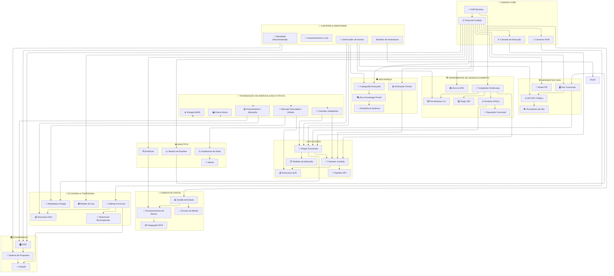
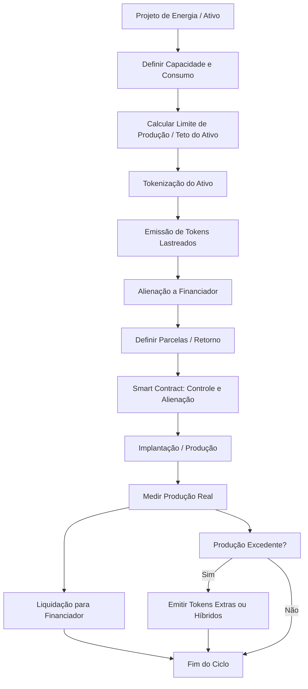

---

# 🌐 Kindelia: Computador Funcional Peer-to-Peer

> *Um cryptocomputer minimalista, seguro, distribuído, com blockchain massivamente paralela e suporte à tokenização de energia e ativos produtivos.*

[](https://github.com/scoobiii/Kindelia/actions)
[](https://github.com/scoobiii/Kindelia)
[](https://github.com/scoobiii/Kindelia/blob/master/docs/DAO_STRUCTURE.md)

---

## 🚧 Visão Geral

Kindelia é um **cryptocomputer funcional** projetado para:

* Execução **massivamente paralela** de DApps.
* Blockchain **permanente e auditável**.
* Governança via **DAO ativa**.
* **Tokenização de energia** (kWh) e **multi-ativos** produtivos.
* Integração de front-end acessível, voz e dispositivos móveis 60+.

O projeto é inspirado em Ethereum e Type-Theory, mas **minimalista, seguro e funcional**, com ~10k LOC em Rust, executando **códigos puramente funcionais** e permitindo auditoria reversível de todos os blocos.

---

## ⚙️ Filosofia Central

| Princípio                      | Detalhes                                                                              |
| ------------------------------ | ------------------------------------------------------------------------------------- |
| 🪙 **Sem moeda nativa**        | Valor reside na computação e no processamento de dados.                               |
| ⚡ **Eficiência Funcional**     | HVM executa termos lambda paralelos com consumo mínimo.                               |
| ⏱️ **Execução em Tempo Real**  | Blocos de 1 segundo, heaps reversíveis, armazenamento gratuito (SSTORE).              |
| 🌎 **Descentralização Máxima** | Governança, financiamento e evolução comunitária.                                     |
| 🧩 **Minimalismo Extremo**     | Apenas o essencial: ~10k LOC vs 600k+ em Geth.                                        |
| 🔄 **Blockchain Paralela**     | Execução e validação massivamente paralela.                                           |
| ⚡ **Tokenização de Ativos**    | Energia (kWh) e outros ativos podem ser financiados e comercializados via blockchain. |
| 🛡️ **Segurança Total**        | Criptografia avançada, ZK-Proofs, resistência quântica e verificação formal.          |

---

## 🌳 Arquitetura Dinâmica

O diagrama abaixo representa todas as camadas do Kindelia, incluindo **tokenização de energia e multi-ativos**:



## ⚡ Tokenização de Energia e Multi-Ativos

A Kindelia agora suporta emissão de tokens lastreados em **energia** e **ativos físicos**, integrados diretamente na **HVM paralelizada**.

Fluxo de tokenização:



---

## 🚀 Iniciando com Docker

```bash
# Build da imagem Docker
docker build -t scoobiii/kindelia .

# Executar nó
docker run -d --name kindelia-node -p 8080:8080 scoobiii/kindelia

# Ou com docker-compose
docker-compose up -d
```

---

## 📂 Estrutura de Arquivos

```
Kindelia/
├── README.md
├── Dockerfile
├── docker-compose.yml
├── Cargo.toml
├── Cargo.lock
├── default.toml
├── rust-toolchain
├── src/
│   ├── api/
│   ├── cli.rs
│   ├── common.rs
│   ├── crypto.rs
│   ├── dao/
│   ├── devtools/
│   ├── hvm.rs
│   ├── node.rs
│   ├── wallet/
│   └── ...
├── docs/
│   ├── WHITEPAPER.md
│   ├── WHITEBOOK.md
│   ├── ARCHITECTURE.md
│   ├── DAO_STRUCTURE.md
│   ├── TOKENIZATION.md
│   └── ...
├── scripts/
│   ├── test.sh
│   └── bench.sh
├── examples/
├── benches/
├── tests/
├── kdl/
├── assets/
└── TODO.md
```


---

## 🧪 Testando Smart Contracts HVM

A Kindelia suporta **smart contracts de energia e multi-ativos**, rodando **paralelamente na HVM**.

### 1. Iniciar nó HVM local

```bash
docker-compose up -d
# ou
docker run -d --name kindelia-node -p 8080:8080 scoobiii/kindelia
```

### 2. Deploy e execução de contratos de energia

```bash
kdl run kdl/energia/token_energia.kdl --node http://localhost:8080
kdl run kdl/energia/alienacao_energia.kdl --node http://localhost:8080
kdl run kdl/energia/producao_excedente.kdl --node http://localhost:8080
kdl run kdl/energia/liquidacao_energia.kdl --node http://localhost:8080
```

### 3. Deploy e execução de contratos multi-ativos

```bash
kdl run kdl/multiativos/token_multiativo.kdl --node http://localhost:8080
kdl run kdl/multiativos/alienacao_multiativo.kdl --node http://localhost:8080
kdl run kdl/multiativos/liquidacao_multiativo.kdl --node http://localhost:8080
```

### 4. Rodar testes automatizados

```bash
cargo test --test integracao/energia_test.rs
cargo test --test integracao/multiativos_test.rs
```

> 🔹 Todos os contratos rodam **nativamente paralelizados** na HVM.
> 🔹 Resultados e logs são persistidos via **State Manager** e podem ser monitorados via **KindScan** ou **Runtime Monitor**.

---

## 📖 Referência Detalhada

Para documentação completa de **deploy, testes, métricas e cobertura**, consulte:

```
docs/DEPLOY_AND_TEST.md
```

Essa seção inclui:

* Configuração avançada de nós HVM
* Debug e logging de smart contracts
* Procedimentos de alienação, liquidação e emissão de tokens
* Integração com DAO e Tesouraria

---


## 📜 Principais Funcionalidades

1. **High-Order Virtual Machine**: Execução funcional de termos lambda com paralelismo.
2. **Blockchain Massivamente Paralela**: Blocos auditáveis, 1s block-time.
3. **Tokenização de Energia e Multi-Ativos**: Financiamento, alienação e mercado secundário.
4. **DAO e Governança**: Propostas, votações e tesouraria comunitária.
5. **Front-End Acessível**: PWA, modo 60+, comandos por voz.
6. **Segurança de Ponta**: Criptografia, ZK-Proofs e resistência quântica.
7. **Ferramentas DevOps e SDK**: CLI, IDE, compilador KindeLang, depurador funcional.
