```mermaid
flowchart TB
    A[Projeto de Energia / Ativo] --> B[Definir Capacidade e Consumo]
    B --> C[Calcular Limite de Produção / Teto do Ativo]
    C --> D[Tokenização do Ativo]
    D --> E[Emissão de Tokens Lastreados]
    E --> F[Alienação a Financiador]
    F --> G[Definir Parcelas / Retorno]
    G --> H[Smart Contract: Controle e Alienação]
    H --> I[Implantação / Produção]
    I --> J[Medir Produção Real]
    J --> K[Liquidação para Financiador]
    J --> L[Produção Excedente?]
    L --> |Sim| M[Emitir Tokens Extras ou Híbridos]
    L --> |Não| N[Fim do Ciclo]
    K --> N
    M --> N
```

---

# 🌐 Kindelia: Computador Funcional Peer-to-Peer

> *Um cryptocomputer minimalista, seguro, distribuído, com blockchain massivamente paralela e suporte à tokenização de energia e ativos produtivos.*

[](https://github.com/scoobiii/Kindelia/actions)
[](https://github.com/scoobiii/Kindelia)
[](https://github.com/scoobiii/Kindelia/blob/master/docs/DAO_STRUCTURE.md)

---

## 🚧 Visão Geral

Kindelia é um **cryptocomputer funcional** projetado para:

* Execução **massivamente paralela** de DApps.
* Blockchain **permanente e auditável**.
* Governança via **DAO ativa**.
* **Tokenização de energia** (kWh) e **multi-ativos** produtivos.
* Integração de front-end acessível, voz e dispositivos móveis 60+.

O projeto é inspirado em Ethereum e Type-Theory, mas **minimalista, seguro e funcional**, com ~10k LOC em Rust, executando **códigos puramente funcionais** e permitindo auditoria reversível de todos os blocos.

---

## ⚙️ Filosofia Central

| Princípio                      | Detalhes                                                                              |
| ------------------------------ | ------------------------------------------------------------------------------------- |
| 🪙 **Sem moeda nativa**        | Valor reside na computação e no processamento de dados.                               |
| ⚡ **Eficiência Funcional**     | HVM executa termos lambda paralelos com consumo mínimo.                               |
| ⏱️ **Execução em Tempo Real**  | Blocos de 1 segundo, heaps reversíveis, armazenamento gratuito (SSTORE).              |
| 🌎 **Descentralização Máxima** | Governança, financiamento e evolução comunitária.                                     |
| 🧩 **Minimalismo Extremo**     | Apenas o essencial: ~10k LOC vs 600k+ em Geth.                                        |
| 🔄 **Blockchain Paralela**     | Execução e validação massivamente paralela.                                           |
| ⚡ **Tokenização de Ativos**    | Energia (kWh) e outros ativos podem ser financiados e comercializados via blockchain. |
| 🛡️ **Segurança Total**        | Criptografia avançada, ZK-Proofs, resistência quântica e verificação formal.          |

---

## 🌳 Arquitetura Dinâmica

O diagrama abaixo representa todas as camadas do Kindelia, incluindo **tokenização de energia e multi-ativos**:

```mermaid
---
config:
    layout: elk
---
flowchart TB
    subgraph CORE["🔷 CAMADA CORE"]
        HVM["⚡ HVM Runtime"]
        KIND["🌐 Protocolo Kindelia"]
        CONS["🔐 Consenso PoW"]
        EXEC["⚙️ Camada de Execução"]
    end

    subgraph INFRA["🏗️ INFRAESTRUTURA"]
        NODES["🖥️ Nós Funcionais"]
        API["🌐 API RPC Pública"]
        PROVIDERS["☁️ Provedores de Nós"]
        P2P["🔗 Rede P2P"]
    end

    subgraph DATA["💾 CAMADA DE DADOS"]
        STATE["📊 Gestão de Estado"]
        BLOCKS["🧊 Armazenamento de Blocos"]
        MERKLE["🌳 Árvores de Merkle"]
        IPFS["📦 Integração IPFS"]
    end

    subgraph DEVTOOLS["🛠️ FERRAMENTAS DE DESENVOLVIMENTO"]
        COMPILER["📝 Compilador KindeLang"]
        HVMJS["🌐 Runtime HVM.js"]
        IDE["💻 Plugin IDE"]
        DOCS["📚 Docs & SDK"]
        CLI["⌨️ Ferramentas CLI"]
        DEBUGGER["🐛 Depurador Funcional"]
    end

    subgraph WALLET["💼 CARTEIRA & IDENTIDADE"]
        UACCESS["🔑 Gerenciador de Acesso"]
        SIGNS["✍️ Motor de Assinaturas"]
        DID["🧬 Identidade Descentralizada"]
        STORAGE["🔐 Armazenamento Local"]
    end

    subgraph SECURITY["🛡️ SEGURANÇA"]
        AUDIT["🔒 Verificação Formal"]
        CRYPTO["🔐 Criptografia Avançada"]
        ZKSEC["🎭 Zero-Knowledge Proofs"]
        QRES["🌌 Resistência Quântica"]
    end

    subgraph ECONOMY["💎 ECONOMIA & TOKENOMIA"]
        GAS["⛽ Modelo de Gas"]
        STAKE["🏦 Staking Funcional"]
        MARKET["🛒 Marketplace DApps"]
        TREASURY["💰 Tesouraria DAO"]
        REWARDS["🎁 Sistema de Recompensas"]
    end

    subgraph GOV["🏛️ GOVERNANÇA"]
        DAO["🗳️ DAO"]
        PROPOSAL["📝 Sistema de Propostas"]
        VOTING["✅ Votação"]
    end

    subgraph APPS["🎯 APLICAÇÕES"]
        DAPPS["🚀 DApps Funcionais"]
        CONTRACTS["📜 Contratos Lambda"]
        TEMPLATES["📋 Modelos de Aplicação"]
        DEFI["💰 Protocolos DeFi"]
        NFT["🎨 Padrões NFT"]
    end

    subgraph ANALYTICS["📊 ANALÍTICA"]
        SCAN["🔍 KindScan"]
        MONITOR["📈 Monitor de Runtime"]
        STATS["📉 Estatísticas de Rede"]
        ALERTS["🔔 Alertas"]
    end

    subgraph TOKEN["⚡ TOKENIZAÇÃO DE ENERGIA & MULTI-ATIVOS"]
        ENERGY["☀️ Energia (kWh)"]
        ASSETS["🏭 Outros Ativos"]
        SMARTCONTRACT["📜 Contratos Inteligentes"]
        FINANCE["💰 Financiamento / Alienação"]
        MARKETPLACE["🛒 Mercado Secundário / Híbrido"]
    end

    %% Conexões
    HVM --> KIND & COMPILER
    KIND --> CONS & EXEC & NODES & P2P & STATE & DOCS & AUDIT & CRYPTO & GAS & DAO & SCAN & MONITOR
    NODES --> API & STATS
    API --> PROVIDERS
    STATE --> BLOCKS & MERKLE
    BLOCKS --> IPFS
    COMPILER --> HVMJS & IDE & CLI & CONTRACTS
    HVMJS --> DEBUGGER & DAPPS
    EXEC --> DAPPS
    DAPPS --> CONTRACTS & TEMPLATES & MARKET
    CONTRACTS --> DEFI & NFT
    CRYPTO --> ZKSEC
    ZKSEC --> QRES
    CONS --> STAKE
    STAKE --> TREASURY & REWARDS & VOTING
    DAO --> PROPOSAL
    PROPOSAL --> VOTING
    STATS --> ALERTS
    SCAN --> BLOCKS
    MONITOR --> NODES
    AUDIT --> CONTRACTS
    WALLET --> API & CRYPTO & DAPPS & DAO
    SIGNS --> POST
    DID --> PROPOSAL
    UACCESS --> DAPPS & CLI
    TOKEN --> SMARTCONTRACT & FINANCE & MARKETPLACE
    ENERGY --> TOKEN
    ASSETS --> TOKEN
    SMARTCONTRACT --> CONTRACTS & DAPPS
    FINANCE --> TREASURY & DAO
    MARKETPLACE --> MARKET & DEFI
```



## ⚡ Tokenização de Energia e Multi-Ativos

A Kindelia agora suporta emissão de tokens lastreados em **energia** e **ativos físicos**, integrados diretamente na **HVM paralelizada**.

Fluxo de tokenização:



---

## 🚀 Iniciando com Docker

```bash
# Build da imagem Docker
docker build -t scoobiii/kindelia .

# Executar nó
docker run -d --name kindelia-node -p 8080:8080 scoobiii/kindelia

# Ou com docker-compose
docker-compose up -d
```

---

## 📂 Estrutura de Arquivos

```
Kindelia/
├── README.md
├── Dockerfile
├── docker-compose.yml
├── Cargo.toml
├── Cargo.lock
├── default.toml
├── rust-toolchain
├── src/
│   ├── api/
│   ├── cli.rs
│   ├── common.rs
│   ├── crypto.rs
│   ├── dao/
│   ├── devtools/
│   ├── hvm.rs
│   ├── node.rs
│   ├── wallet/
│   └── ...
├── docs/
│   ├── WHITEPAPER.md
│   ├── WHITEBOOK.md
│   ├── ARCHITECTURE.md
│   ├── DAO_STRUCTURE.md
│   ├── TOKENIZATION.md
│   └── ...
├── scripts/
│   ├── test.sh
│   └── bench.sh
├── examples/
├── benches/
├── tests/
├── kdl/
├── assets/
└── TODO.md
```

---

## 📜 Principais Funcionalidades

1. **High-Order Virtual Machine**: Execução funcional de termos lambda com paralelismo.
2. **Blockchain Massivamente Paralela**: Blocos auditáveis, 1s block-time.
3. **Tokenização de Energia e Multi-Ativos**: Financiamento, alienação e mercado secundário.
4. **DAO e Governança**: Propostas, votações e tesouraria comunitária.
5. **Front-End Acessível**: PWA, modo 60+, comandos por voz.
6. **Segurança de Ponta**: Criptografia, ZK-Proofs e resistência quântica.
7. **Ferramentas DevOps e SDK**: CLI, IDE, compilador KindeLang, depurador funcional.
