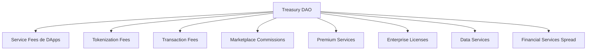

# 💰 Kindelia Monetization Model
> Tokenless Incentives, Asset Tokenization and Ecosystem Sustainability

---

## 📋 Table of Contents

1. [Overview](#1-overview)
2. [Core Philosophy](#2-core-philosophy)
3. [Incentive Layers](#3-incentive-layers)
4. [Asset Tokenization Revenue Streams](#4-asset-tokenization-revenue-streams)
5. [Treasury Management](#5-treasury-management)
6. [Node & User Economics](#6-node--user-economics)
7. [Service Tiers & Pricing](#7-service-tiers--pricing)
8. [Revenue Projections](#8-revenue-projections)
9. [Sustainability & Auditability](#9-sustainability--auditability)
10. [Integration with PWA and UX60+](#10-integration-with-pwa-and-ux60)
11. [Future Enhancements](#11-future-enhancements)

---

## 1. Overview

Kindelia é um **cryptocomputer** sem moeda nativa especulativa. Seu valor está na **computação, verificação, execução de DApps e tokenização de ativos reais**. A monetização ocorre de forma **direta e transparente**, usando mecanismos de incentivo baseados em:

- ⚡ Consumo computacional (HVM execution)
- 💾 Provisão de storage e rede P2P
- 🗳️ Serviços de DAO (governança e treasury)
- 🛒 Marketplace de DApps e integrações
- 🏭 **Tokenização de ativos produtivos** (energia, safras, imóveis, etc.)
- 💼 **Serviços financeiros** (custódia, liquidação, marketplace)
- 📊 **Analytics e data services**

---

## 2. Core Philosophy

### 2.1 Princípios Fundamentais

**Kindelia não tem token especulativo porque:**
- ❌ Evita volatilidade que prejudica negócios reais
- ❌ Elimina especulação financeira
- ❌ Reduz barreiras regulatórias
- ✅ Foca em **valor real de ativos e serviços**
- ✅ Monetização baseada em **utilidade, não especulação**
- ✅ Transparência total de custos e receitas

### 2.2 Value Flows

```
Real Assets (Energia, Safras, Imóveis)
         ↓
   Tokenização na Kindelia
         ↓
   Smart Contracts (HVM)
         ↓
Marketplace & Serviços Financeiros
         ↓
   Receitas da Rede
         ↓
Treasury DAO → Distribuição justa para:
  - Node operators
  - Developers
  - Governance participants
  - Infrastructure
```

---

## 3. Incentive Layers

### 3.1 Computational Contributions

**Modelo:**
- Usuários que disponibilizam **CPU/GPU para execução HVM** recebem **créditos computacionais**
- 1 crédito = 1 hora de computação HVM standard
- Créditos podem ser trocados por **serviços premium de DApps**, storage extra ou prioridade em execução de contratos

**Pricing:**
```
Standard Compute: 1 credit/hour
High Performance: 2 credits/hour  
GPU Acceleration: 5 credits/hour
```

**Recompensas:**
- Base: 10 credits/dia por node ativo
- Performance bonus: até 50% adicional
- Uptime > 99%: 20% bonus

---

### 3.2 Storage & State Contributions

**Modelo:**
- Nodes que fornecem **persistência de blocos e merkle trees** recebem **recompensas de rede** baseadas no uptime e disponibilidade
- Incentivo é auditável e registrado on-chain
- IPFS integration para storage distribuído

**Pricing:**
```
Storage Tier 1: 100GB = 5 credits/mês
Storage Tier 2: 1TB = 40 credits/mês
Storage Tier 3: 10TB = 300 credits/mês
```

**Recompensas:**
- 1 credit/dia por 100GB stored
- Fast retrieval bonus: 10% extra
- Geographic diversity bonus: 15% extra

---

### 3.3 Governance & DAO

**Modelo:**
- Participantes ativos em **propostas e votações** recebem **participação em treasury**
- Treasury financia melhorias, manutenção e integração com DApps pagos
- DAO também distribui **bounties** para desenvolvimento de novos recursos ou auditorias de segurança

**Incentivos:**
```
Proposta aprovada: 100-1000 credits (baseado em impacto)
Voto regular: 1 credit/voto
Participação mensal > 80%: 50 credits bonus
Code review: 20-200 credits
Auditoria de segurança: 500-5000 credits
```

---

### 3.4 DApps & Service Fees

**Modelo:**
- Desenvolvedores podem criar **DApps pagos** que utilizam recursos da rede
- Taxa é medida em **computational credits** ou **service credits**, não tokens

**Fee Structure:**
```
Smart Contract Deploy: 10-100 credits (baseado em complexidade)
Transaction Execution: 0.1-10 credits
Storage per MB: 0.5 credits/mês
API Calls: 0.01 credits/call
```

---

## 4. Asset Tokenization Revenue Streams

### 4.1 Token Issuance Services

**Serviços oferecidos:**

#### 🌞 Energy Tokens (Solar, Wind, etc.)
```
Basic Issuance:
- Capacity analysis: 50 credits
- Token creation: 100 credits
- Smart contract setup: 200 credits
- IoT integration: 300 credits
Total: 650 credits (~R$ 650)

Professional Package:
- Everything in Basic
- Legal compliance check: 500 credits
- Insurance integration: 300 credits
- Marketplace listing: 200 credits
Total: 1,650 credits (~R$ 1,650)

Enterprise Package:
- Everything in Professional
- Custom smart contracts: 1,000 credits
- Dedicated support: 500 credits/mês
- White label solution: 2,000 credits
Total: 5,150 credits + recurring
```

#### 🌾 Agricultural Tokens (Safras, Pecuária)
```
Crop Tokenization:
- Soil/weather analysis: 100 credits
- Yield estimation model: 200 credits
- Parametric insurance: 400 credits
- Token issuance: 150 credits
Total: 850 credits

Livestock Tokenization:
- RFID integration: 300 credits
- Health monitoring: 200 credits
- Token per animal: 10 credits each
- Marketplace integration: 150 credits
```

#### 🏢 Real Estate Tokens
```
Property Fractionalization:
- Legal structure review: 500 credits
- Property valuation: 300 credits
- Token issuance (up to 10,000 tokens): 800 credits
- Rent distribution setup: 400 credits
- Voting system: 300 credits
Total: 2,300 credits (~R$ 2,300)

Monthly Management: 100-500 credits/mês
```

#### 🌳 Carbon Credits
```
Forest Project:
- Satellite monitoring setup: 400 credits
- Carbon capture calculation: 300 credits
- Verification & certification: 600 credits
- Token issuance: 200 credits
Total: 1,500 credits

Annual Recertification: 500 credits/ano
```

---

### 4.2 Transaction Fees

**Modelo de comissões transparente:**

```
Primary Market (Emissão inicial):
- Fee: 0.5% - 1.5% do valor tokenizado
- Mínimo: 100 credits
- Máximo: 10,000 credits por emissão

Secondary Market (Negociações):
- Buyer fee: 0.25%
- Seller fee: 0.25%
- Total: 0.5% por transação
- Mínimo: 1 credit por transação

P2P Transfers:
- Grátis para transferências até 100 tokens/mês
- Acima: 0.1 credit por transferência
```

**Volume Discounts:**
```
Tier 1 (0-1000 tokens/mês): Fee padrão
Tier 2 (1001-10,000): -20% fee
Tier 3 (10,001-100,000): -40% fee  
Tier 4 (100,001+): -60% fee
```

---

### 4.3 Financial Services

#### Custódia (Custody)
```
Self-custody: Grátis
Managed custody: 0.1% a.a. do valor custodiado
Institutional custody: 0.05% a.a. + 500 credits setup
```

#### Liquidação Automática
```
Basic settlement: 10 credits por liquidação
Scheduled settlement: 5 credits por liquidação programada
Instant settlement: 20 credits (< 1 segundo)
```

#### Lending & Borrowing (DeFi)
```
Platform fee: 0.5% do valor emprestado
Interest spread: 1-3% (parte para treasury)
Liquidation fee: 5% em caso de liquidação
```

#### Derivativos e Futuros
```
Futures contract creation: 100 credits
Options contract: 150 credits
Trading fee: 0.3% por lado
Settlement: 20 credits
```

---

### 4.4 Data & Analytics Services

```
Public APIs:
- 1,000 calls/dia: Grátis
- 10,000 calls/dia: 50 credits/mês
- 100,000 calls/dia: 400 credits/mês
- Unlimited: 2,000 credits/mês

Premium Analytics:
- Historical data export: 100 credits/query
- Custom reports: 200-1,000 credits
- Real-time dashboards: 300 credits/mês
- ML predictions: 500 credits/mês

Enterprise BI:
- Custom integration: 2,000 credits setup
- Dedicated database: 500 credits/mês
- SLA 99.9%: 1,000 credits/mês
```

---

### 4.5 Compliance & Certification

```
KYC/AML Services:
- Basic verification: 5 credits/usuário
- Enhanced due diligence: 20 credits/usuário
- Corporate KYC: 100 credits/empresa
- Ongoing monitoring: 10 credits/mês por usuário

Legal Compliance:
- Token structure review: 500 credits
- Regulatory compliance check: 800 credits
- Securities classification: 1,000 credits
- Annual audit: 2,000 credits

Certification Services:
- Smart contract audit: 1,000-10,000 credits
- Security assessment: 2,000 credits
- Performance certification: 500 credits
```

---

## 5. Treasury Management

### 5.1 Fontes de Receita



**Breakdown estimado (após escala):**
```
Tokenization fees: 35%
Transaction fees: 25%
Financial services: 20%
Premium APIs/Data: 10%
Enterprise services: 7%
Other: 3%
```

---

### 5.2 Alocação de Recursos

**Modelo de distribuição da Treasury:**

```
Infrastructure & Nodes: 35%
- Node incentives: 25%
- Storage rewards: 5%
- Network maintenance: 5%

Development & Innovation: 30%
- Core development: 15%
- Bounties & grants: 10%
- Security audits: 5%

Governance & Community: 15%
- DAO participation rewards: 8%
- Community initiatives: 5%
- Education & docs: 2%

Marketing & Growth: 10%
- User acquisition: 5%
- Partnerships: 3%
- Events & conferences: 2%

Reserve Fund: 10%
- Emergency fund: 7%
- Strategic opportunities: 3%
```

---

### 5.3 Transparência Total

**Todos os fluxos são públicos e auditáveis:**

```
Daily Treasury Report:
- Total inflows (by category)
- Total outflows (by category)
- Active proposals and budgets
- Reserve balance
- Node operator payments
- Developer bounties paid

Monthly Governance Report:
- Top contributors
- Approved proposals
- Budget execution
- Network growth metrics
- Revenue vs. expenses
```

**Dashboard público:** `treasury.kindelia.org`

---

## 6. Node & User Economics

### 6.1 Node Operator Economics

**Investment:**
```
Hardware inicial: R$ 3,000 - R$ 10,000
- CPU: Ryzen 5 ou equivalente
- RAM: 16GB mínimo
- Storage: 1TB SSD
- Network: 100Mbps simétrico

Custos operacionais: R$ 200-500/mês
- Energia elétrica
- Internet
- Manutenção
```

**Retorno esperado:**
```
Small Node (100GB storage, uptime 95%):
- Compute credits: 300/mês
- Storage credits: 150/mês
- Bonus: 50/mês
Total: 500 credits/mês (~R$ 500)

Medium Node (1TB storage, uptime 99%):
- Compute credits: 500/mês
- Storage credits: 500/mês
- Bonus: 200/mês
Total: 1,200 credits/mês (~R$ 1,200)

Large Node (10TB storage, uptime 99.9%):
- Compute credits: 800/mês
- Storage credits: 3,000/mês
- Bonus: 700/mês
Total: 4,500 credits/mês (~R$ 4,500)

ROI esperado: 6-18 meses
```

---

### 6.2 User Economics

| User Type | Monthly Usage | Cost | Value Received |
|-----------|--------------|------|----------------|
| **Casual User** | 10 transactions | Grátis - 10 credits | Basic access to DApps |
| **Active Trader** | 100 transactions | 50-100 credits | Token trading, portfolio management |
| **Token Issuer** | 1 asset tokenized | 650-5,000 credits | Complete tokenization service |
| **Investor** | 20 investments | 50-200 credits | Access to primary & secondary markets |
| **Developer** | API + hosting | 200-2,000 credits | DApp deployment & operation |
| **Enterprise** | Custom solutions | 5,000+ credits/mês | White label, SLA, dedicated support |

---

### 6.3 Developer Economics

**Costs to build on Kindelia:**
```
Smart Contract Development:
- Learning curve: 2-4 semanas
- Deployment: 10-100 credits
- Testing: Grátis (testnet)
- Audit: 1,000-5,000 credits (opcional)

DApp Hosting:
- Frontend (IPFS): Grátis
- Backend API: 50-500 credits/mês
- Database: 100-1,000 credits/mês
- Custom domain: 10 credits/mês
```

**Revenue potential:**
```
Freemium DApp:
- 1,000 free users: R$ 0
- 100 premium users @ R$ 20/mês: R$ 2,000/mês
- Platform takes: 10% = R$ 200
- Developer net: R$ 1,800/mês

Paid DApp:
- 500 users @ R$ 50/mês: R$ 25,000/mês
- Platform takes: 10% = R$ 2,500
- Developer net: R$ 22,500/mês

Transaction-based:
- 10,000 transactions/mês @ 1 credit
- Developer keeps: 80% = 8,000 credits
- Platform keeps: 20% = 2,000 credits
```

---

## 7. Service Tiers & Pricing

### 7.1 Individual Users

#### Free Tier
```
✅ Wallet creation
✅ 10 transactions/mês
✅ Basic token trading
✅ Community forum access
✅ Basic analytics
```

#### Pro Tier - 100 credits/mês (~R$ 100)
```
✅ Everything in Free
✅ 100 transactions/mês
✅ Advanced analytics
✅ Priority support (email)
✅ API access (1,000 calls)
✅ Custom alerts
```

#### Premium Tier - 500 credits/mês (~R$ 500)
```
✅ Everything in Pro
✅ Unlimited transactions
✅ Premium analytics & AI insights
✅ Priority support (chat + phone)
✅ API access (10,000 calls)
✅ Dedicated account manager
✅ Early access to new features
```

---

### 7.2 Business Tiers

#### Startup - 1,000 credits/mês (~R$ 1,000)
```
✅ Up to 5 team members
✅ 5,000 API calls/mês
✅ 1 asset tokenization included
✅ Basic compliance tools
✅ Email support
✅ Community resources
```

#### Growth - 5,000 credits/mês (~R$ 5,000)
```
✅ Up to 20 team members
✅ 50,000 API calls/mês
✅ 5 asset tokenizations/ano
✅ Advanced compliance & KYC
✅ Priority support
✅ Custom integrations
✅ Dedicated onboarding
```

#### Enterprise - Custom pricing
```
✅ Unlimited team members
✅ Unlimited API calls
✅ Unlimited tokenizations
✅ White label solution
✅ Custom smart contracts
✅ SLA 99.9%
✅ 24/7 dedicated support
✅ On-premise deployment option
✅ Custom compliance workflows
✅ Dedicated infrastructure
```

---

### 7.3 Financial Institutions

#### Basic Integration - 10,000 credits/mês
```
✅ API access for trading
✅ Custody integration
✅ Compliance reporting
✅ KYC/AML tools
✅ Standard support
```

#### Advanced Integration - 50,000 credits/mês
```
✅ Everything in Basic
✅ White label trading platform
✅ Custom derivatives
✅ Institutional custody
✅ Regulatory reporting automation
✅ Dedicated account team
```

#### Full Banking Suite - 200,000+ credits/mês
```
✅ Everything in Advanced
✅ Core banking integration
✅ Custom tokenization products
✅ Private blockchain option
✅ Dedicated infrastructure
✅ 24/7 enterprise support
✅ Legal & compliance consulting
✅ Custom SLAs
```

---

## 8. Revenue Projections

### 8.1 Year 1 (2025) - Bootstrapping

**Assumptions:**
- 100 active nodes
- 1,000 monthly active users
- 50 tokenization projects
- 10,000 transactions/mês

**Revenue:**
```
Tokenization fees: R$ 50,000
Transaction fees: R$ 5,000
Service subscriptions: R$ 20,000
Enterprise contracts: R$ 30,000
Total monthly: R$ 105,000
Total annual: R$ 1,260,000
```

**Expenses:**
```
Node incentives: R$ 50,000/mês
Development: R$ 30,000/mês
Infrastructure: R$ 10,000/mês
Marketing: R$ 10,000/mês
Operations: R$ 15,000/mês
Total monthly: R$ 115,000
Total annual: R$ 1,380,000

Net Year 1: -R$ 120,000 (covered by treasury reserve)
```

---

### 8.2 Year 2 (2026) - Growth

**Assumptions:**
- 500 active nodes
- 10,000 monthly active users
- 200 tokenization projects
- 100,000 transactions/mês

**Revenue:**
```
Tokenization fees: R$ 400,000
Transaction fees: R$ 50,000
Service subscriptions: R$ 150,000
Enterprise contracts: R$ 200,000
Data services: R$ 50,000
Total monthly: R$ 850,000
Total annual: R$ 10,200,000
```

**Expenses:**
```
Node incentives: R$ 250,000/mês
Development: R$ 100,000/mês
Infrastructure: R$ 50,000/mês
Marketing: R$ 100,000/mês
Operations: R$ 50,000/mês
Total monthly: R$ 550,000
Total annual: R$ 6,600,000

Net Year 2: +R$ 3,600,000 (profitable)
```

---

### 8.3 Year 3 (2027) - Scale

**Assumptions:**
- 2,000 active nodes
- 50,000 monthly active users
- 1,000 tokenization projects
- 1,000,000 transactions/mês

**Revenue:**
```
Tokenization fees: R$ 2,000,000
Transaction fees: R$ 500,000
Service subscriptions: R$ 1,000,000
Enterprise contracts: R$ 1,500,000
Financial services: R$ 800,000
Data services: R$ 200,000
Total monthly: R$ 6,000,000
Total annual: R$ 72,000,000
```

**Expenses:**
```
Node incentives: R$ 1,000,000/mês
Development: R$ 500,000/mês
Infrastructure: R$ 300,000/mês
Marketing: R$ 500,000/mês
Operations: R$ 200,000/mês
Reserve allocation: R$ 500,000/mês
Total monthly: R$ 3,000,000
Total annual: R$ 36,000,000

Net Year 3: +R$ 36,000,000
```

---

## 9. Sustainability & Auditability

### 9.1 Princípios de Sustentabilidade

✅ **No speculative token**: Evita bolhas e crashes
✅ **Value-based economy**: Receitas baseadas em uso real
✅ **Transparent treasury**: Toda transação auditável
✅ **Fair distribution**: Recompensas proporcionais à contribuição
✅ **Long-term focus**: Não há pressão por crescimento artificial
✅ **Community governance**: DAO decide prioridades

---

### 9.2 Auditabilidade Total

**Todos os créditos computacionais são:**
- ✅ Registrados on-chain
- ✅ Rastreáveis até a origem
- ✅ Verificáveis por qualquer participante
- ✅ Imutáveis após confirmação

**Ferramentas de auditoria:**
```
KindScan Explorer:
- Transaction history
- Credit flows
- Treasury movements
- Node performance
- DAO proposals & votes

Treasury Dashboard:
- Real-time balance
- Income sources breakdown
- Expense categories
- Historical trends
- Projections

Analytics API:
- Export all data
- Custom reports
- Programmatic access
- Compliance reports
```

---

### 9.3 Sustainability Metrics

**Key Performance Indicators (KPIs):**
```
Network Health:
- Active nodes: Target 1,000+ (Year 2)
- Network uptime: Target 99.9%
- Transaction throughput: Target 1,000 TPS
- Storage capacity: Target 1 PB

Economic Health:
- Monthly recurring revenue: Target R$ 6M (Year 3)
- Treasury balance: Min 6 months runway
- Node ROI: 6-12 months
- Developer earnings: Avg R$ 10k/mês

Ecosystem Growth:
- Active users: Target 50k (Year 3)
- DApps launched: Target 500 (Year 3)
- Tokens issued: Target 10k (Year 3)
- Enterprise clients: Target 100 (Year 3)
```

---

## 10. Integration with PWA and UX60+

### 10.1 User Interface

**Usuários podem ver no front-end PWA:**

```
Dashboard Principal:
✅ Saldo de créditos
✅ Histórico de transações
✅ Tokens em portfólio
✅ Rendimentos mensais
✅ Propostas DAO ativas
✅ Alertas e notificações

Modo Simplificado (UX60+):
✅ Fontes grandes e legíveis
✅ Contraste alto
✅ Comandos por voz
✅ Tutoriais passo-a-passo
✅ Suporte assistido
✅ Interface minimalista
```

---

### 10.2 Acessibilidade

**Features para todos os públicos:**
- 🗣️ **Voice commands**: "Mostre meus tokens", "Quanto ganhei hoje?"
- 👁️ **High contrast mode**: Para melhor visibilidade
- 📱 **Mobile-first**: Otimizado para smartphones
- 🌐 **Multi-language**: PT, EN, ES inicialmente
- ♿ **WCAG 2.1 compliant**: Acessibilidade total
- 📞 **Support hotline**: Suporte por telefone

---

## 11. Future Enhancements

### 11.1 Short-term (6-12 months)

```
✅ Cross-network computational credit swaps
✅ Marketplace de DApps com micro-serviços
✅ Gamification: badges e ranking para nodes e desenvolvedores
✅ Mobile apps nativas (iOS/Android)
✅ Integração com mais exchanges
```

---

### 11.2 Medium-term (1-2 years)

```
🔮 Auditorias externas de performance e treasury
🔮 AI-powered analytics e predictions
🔮 Derivatives market (futures, options)
🔮 Insurance marketplace
🔮 Decentralized credit scoring
🔮 Multi-chain bridges
```

---

### 11.3 Long-term (2-5 years)

```
🌟 Global expansion (mercados internacionais)
🌟 Tokenization of everything (qualquer ativo)
🌟 Central Bank Digital Currency (CBDC) integration
🌟 Quantum-resistant upgrades
🌟 AI-governed smart contracts
🌟 Self-evolving treasury algorithms
```

---

## 12. Comparison with Traditional Models

### 12.1 Kindelia vs. Ethereum

| Feature | Kindelia | Ethereum |
|---------|----------|----------|
| **Native Token** | ❌ None | ✅ ETH (speculative) |
| **Gas Fees** | Credits (stable) | ETH (volatile) |
| **Transaction Cost** | $0.01 - $1 | $5 - $50+ |
| **Sustainability** | Usage-based | Speculation-based |
| **Governance** | DAO (transparent) | Mixed (opaque) |
| **Code Size** | 10k LOC | 600k+ LOC |
| **Energy Efficiency** | Very high | Moderate (post-merge) |

---

### 12.2 Kindelia vs. Traditional Finance

| Aspect | Kindelia | Traditional Finance |
|--------|----------|---------------------|
| **Tokenization Cost** | R$ 650 - R$ 5,000 | R$ 50,000 - R$ 500,000 |
| **Time to Market** | 1-7 dias | 3-12 meses |
| **Intermediaries** | None (direct) | Multiple (banks, brokers) |
| **Transparency** | 100% on-chain | Limited reporting |
| **Global Access** | 24/7 | Business hours only |
| **Minimum Investment** | R$ 10 | R$ 1,000 - R$ 10,000 |
| **Liquidity** | High (instant trading) | Low (lock-up periods) |

---

## 13. Conclusion

O modelo de monetização da Kindelia é:

✅ **Sustentável**: Baseado em valor real, não especulação
✅ **Transparente**: Toda receita e gasto auditável on-chain
✅ **Justo**: Recompensas proporcionais à contribuição
✅ **Escalável**: Cresce com adoção orgânica
✅ **Democrático**: DAO governa prioridades
✅ **Inovador**: Combina o melhor de blockchain e fintech tradicional

**Key Takeaway**: Kindelia prova que é possível construir um ecossistema blockchain robusto e sustentável **sem depender de tokens especulativos**, focando em **valor real de ativos produtivos e serviços computacionais**.

---

## 📞 Contact & Resources

### Oficial
- 🌐 **GitHub**: [github.com/scoobiii/Kindelia](https://github.com/scoobiii/Kindelia)
- 📧 **Email**: scoobiii@gmail.com
- 📊 **Treasury Dashboard**: [treasury.kindelia.org](https://treasury.kindelia.org)
- 📖 **Docs**: [docs.kindelia.org](https://docs.kindelia.org)

### Community
- 💬 **Discord**: [discord.gg/kindelia](https://discord.gg/kindelia)
- 📱 **Telegram**: [t.me/kindelia](https://t.me/kindelia)
- 🐦 **Twitter**: [@KindeliaNet](https://twitter.com/KindeliaNet)
- 💼 **LinkedIn**: [linkedin.com/company/kindelia](https://linkedin.com/company/kindelia)

---

**Last Updated**: October 2025  
**Version**: 2.0  
**Contributors**: scoobiii + Core Team + Community
